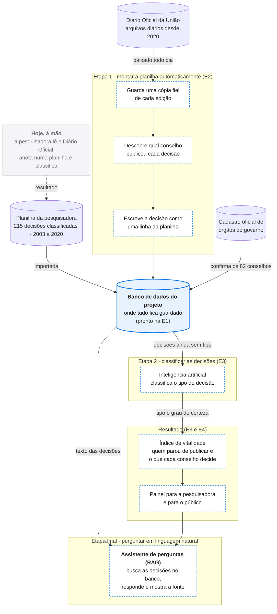

# Jornada do dado

Hoje, a pesquisadora lê o Diário Oficial ato por ato, anota cada um numa planilha e classifica na tipologia. A plataforma faz o mesmo caminho em duas etapas:

1. **Replicar a planilha:** ler o DOU e produzir, para todos os conselhos, as mesmas linhas que ela escreve à mão.
2. **Enriquecer com a tipologia dela:** uma IA classificatória atribui a cada ato uma das categorias que ela usa.

  

    Hoje · à mão
    <strong>Ler o DOU</strong>
    
Ato por ato, conselho por conselho.

  

  

    Hoje · à mão
    <strong>Anotar na planilha</strong>
    
Data, ato, autor e tema. Cinco abas, cinco conselhos.

  

  

    Hoje · à mão
    <strong>Classificar</strong>
    
DEF, FISC, GEST, AUTO ou IP.

  

  

    Plataforma · etapa 1
    <strong>Baixar o Diário Oficial</strong>
    
Automaticamente, todo dia útil.

  

  

    Plataforma · etapa 1
    <strong>Replicar a planilha</strong>
    
As mesmas linhas, para os 82 conselhos.

  

  

    Plataforma · etapa 2
    <strong>A IA classifica</strong>
    
Na tipologia dela, em escala.

  

## O caminho completo

Cinza: o trabalho feito hoje à mão. Azul cheio: já pronto. Contorno tracejado: o que vem nas próximas etapas, até o assistente de perguntas.

## O ciclo de vida, estágio por estágio

A disciplina percorre os cinco estágios do ciclo de vida do dado. Cada estágio tem uma entrega.

| Estágio | No projeto | Situação |
|---|---|---|
| **Geração** | O DOU nasce na Imprensa Nacional. A classificação nasce na curadoria, que é o nosso OLTP ([ADR 0001](/docs/adr/0001-adotar-sistema-de-curadoria-insert-only-como-oltp)). | E1 ✅ |
| **Armazenamento** | OLTP de curadoria em PostgreSQL 16 ([ADR 0002](/docs/adr/0002-manter-postgresql-como-motor-do-oltp)), com os 215 atos e as classificações da pesquisadora. | E1 ✅ |
| **Ingestão** | O DOU em XML pelo INLABS, em lote diário, e as mudanças da curadoria por CDC, gravados em formato aberto (Parquet). | E2 |
| **Transformação** | A planilha replicada, a tipologia proposta pela IA e o indicador de vitalidade por conselho. | E3 |
| **Disponibilização** | O indicador publicado para a pesquisadora e, no fim, um assistente de perguntas (RAG). | E4 em diante |

## Etapa 1 · Replicar a planilha

**O que já existe (E1).** A planilha dela está dentro do banco: 215 atos de 5 conselhos, lidos sem passo manual ([relatório da carga](/docs/carga/relatorio-planilha)). Os 125 nomes de conselho que ela mapeou viram 82 órgãos, e cada grafia vira um *alias* ([identidade dos conselhos](/docs/carga/relatorio-conselhos)).

**O que vem (E2).**

1. **Ingerir o DOU:** o INLABS publica cada edição em XML. Resoluções de conselho ficam na Seção 1, que tem cerca de 300 matérias por dia útil.
2. **Achar o conselho:** cada matéria traz o campo `artCategory` com a hierarquia do órgão emissor. O último nível é casado com os *aliases* da identidade dos conselhos ([ADR 0004](/docs/adr/0004-resolver-identidade-dos-conselhos-por-chave-e-decisao-registrada)). Nome não reconhecido não é descartado: vira pendência para a curadoria.
3. **Escrever a linha da planilha:** data, ato, conselho emissor e ementa, gravados em `ato` com `origem = 'DOU'`, ao lado dos atos com `origem = 'PLANILHA'`.

**Como saber que a replicação funciona.** Os atos que ela anotou à mão servem de gabarito: a plataforma precisa encontrar no DOU cada um deles, com a mesma data e o mesmo conselho.

::: warning Limite conhecido
O INLABS só tem o DOU em XML a partir de **1º/1/2020**, e **só 4 dos 215 atos da planilha são de 2020 em diante** (todos do CNPIR; os demais vão de 2003 a 2009). Comparar a replicação com o trabalho manual exige outra fonte do DOU para antes de 2020, ou uma amostra nova classificada pela pesquisadora. É uma decisão da E2.
:::

## Etapa 2 · Enriquecer com a tipologia

**Como funciona.** Uma IA classificatória lê cada ato e atribui uma das cinco categorias, ou `99` (fora da tipologia). A classificação entra em `classificacao` com o revisor `PIPELINE` e um grau de certeza. As classificações que a pesquisadora já fez continuam guardadas ao lado ([insert-only, ADR 0001](/docs/adr/0001-adotar-sistema-de-curadoria-insert-only-como-oltp)): nada é sobrescrito.

**Como medir se a IA acerta.** Os 215 atos que ela já classificou são o gabarito. A acurácia é a concordância entre a classificação da IA e a dela.

**O gabarito é desbalanceado.** É isso que a avaliação precisa levar em conta:

| DEF | FISC | GEST | AUTO | IP | 99 |
|---|---|---|---|---|---|
| 68 | 31 | 6 | 97 | 7 | 6 |

Com só 6 exemplos de `GEST` e 7 de `IP`, a acurácia geral esconde os erros nas categorias raras. A medição precisa ser **por categoria**.

**Que IA.** Ainda é uma decisão em aberto: regras, classificador clássico ou modelo de linguagem rodando localmente. Ela vai virar um ADR, com as três alternativas medidas sobre os 215 atos ([decisões em aberto](/docs/adr/#decisoes-em-aberto)).

## Depois das duas etapas

Com a planilha replicada e classificada para os 82 conselhos, o **indicador de vitalidade** combina dois sinais:

- **Silêncio:** há quanto tempo cada conselho não publica, contado contra um censo independente do DOU. Um conselho que não publica não aparece no DOU, e a ausência é justamente o que se quer medir.
- **Tipologia ao longo do tempo:** um conselho que só produz `AUTO` está se administrando, não decidindo política pública.

## Etapa final · um assistente de perguntas (RAG)

Com as decisões guardadas e classificadas, o último passo é deixar qualquer pessoa **perguntar em linguagem natural**, por exemplo: *"o que o CONAMA decidiu sobre licenciamento em 2023?"* ou *"quais conselhos não publicam nada há mais de um ano?"*.

O assistente usa **RAG** (geração aumentada por recuperação): antes de responder, ele **busca no banco as decisões relevantes** e só então escreve a resposta, **citando o ato do Diário Oficial** de onde tirou cada informação. Assim, a resposta pode ser conferida, e o assistente não inventa o que não está nos documentos.

O que isso exige das etapas anteriores:

- **O texto integral das decisões:** só os atos lidos do Diário Oficial têm o texto completo (`origem = 'DOU'`). Os 215 atos da planilha têm só a ementa, então o assistente vai conhecer bem o período a partir de 2020.
- **A identidade dos conselhos resolvida:** para a pergunta "o que o CONAMA decidiu", o assistente precisa saber que todas as grafias e nomes antigos são o mesmo conselho ([ADR 0004](/docs/adr/0004-resolver-identidade-dos-conselhos-por-chave-e-decisao-registrada)).
- **A classificação da IA com o grau de certeza:** perguntas sobre o tipo de decisão usam a categoria atribuída pela IA, e o assistente mostra o quanto ela tinha certeza.

